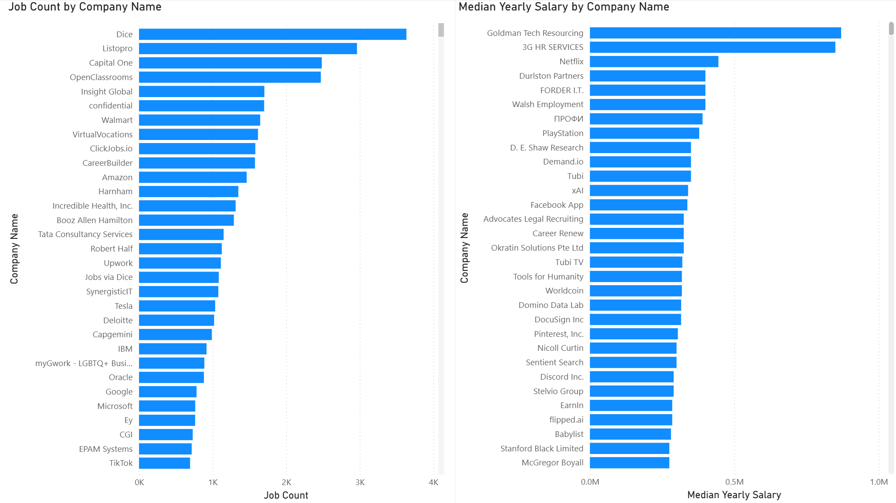
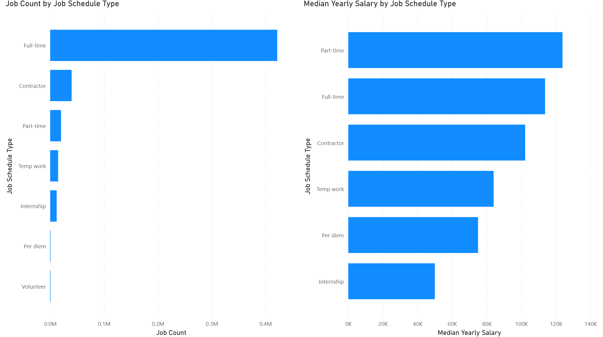

# 📊 Job Market Analysis Dashboard
This project features a comprehensive Power BI dashboard designed to analyze the job market landscape. It provides insights into hiring trends across various companies and evaluates how different job schedules impact earning potential.

## 🎯 Project Overview
The goal of this analysis is to help job seekers and recruiters understand which companies are the most active in hiring and which employment types offer the most competitive salaries. The data is visualized through two main lenses: Company Performance and Schedule Metrics.

## 🏢 Company Statistics
The first dashboard focuses on the volume of job postings and salary distributions across major employers.

Job Count by Company Name: Highlights the top-tier hirers. Platforms and companies like Dice, Listopro, and Capital One lead the way in total job volume.

Median Yearly Salary by Company Name: Identifies the highest-paying organizations. Firms like Goldman Tech Resourcing and 3G HR Services show significantly higher median salaries compared to the high-volume hirers, suggesting a focus on niche or high-seniority roles.

## ⏳ Schedule & Employment Type
The second dashboard breaks down the market by the nature of the work contract.

Market Dominance: Full-time roles overwhelmingly dominate the market share in terms of total job counts.

Salary Paradox: Interestingly, while Full-time roles are the most common, Part-time roles show a high median yearly salary in this specific dataset, closely followed by Full-time and Contract positions.

Emerging Categories: Data also tracks specialized categories such as Temp work, Per diem, and Internships to provide a full spectrum of the modern workforce.

## 🛠️ Tools Used
Power BI: For data visualization and dashboard creation.

DAX: Used for calculating median salaries and job aggregations.

Data Modeling: Implementation of a Star Schema (visible in the fields pane) including job_posting_fact, company_dim, and skills_dim.

## 📈 Key Insights
Volume vs. Value: The companies with the most job openings aren't always the ones offering the highest median salaries.

Contracting Power: Contractor roles maintain a strong median salary, often rivaling full-time positions, which reflects the high demand for specialized freelance talent.

Entry Level: Internships, while lowest in salary, are tracked to show the pipeline of new talent entering the industry.
